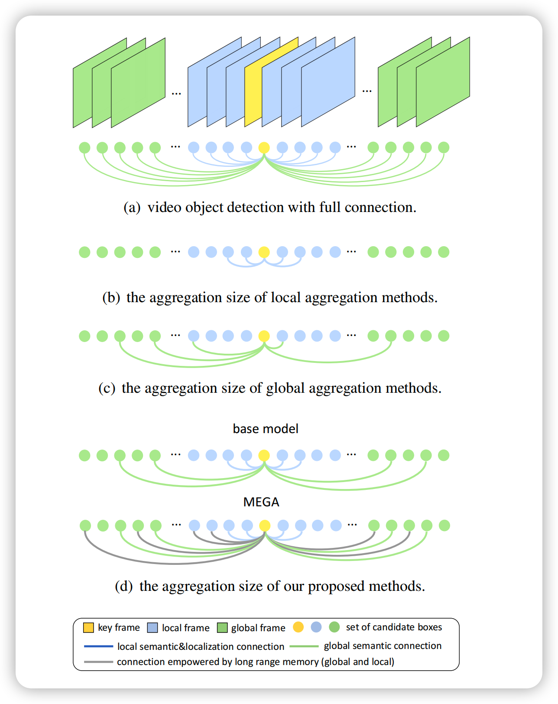

# Memory Enhanced Global-local Aggregtation for Video Object Detection

## 1. Abstract

作者认为，对于人类而言，只凭单帧提供的信息，很难辨认出物体是否存在。而视频目标检测与单帧目标检测之间的区别，在于对于一段连续视频而言，即使有的物体因为运动残影、遮挡或相机失焦等原因在单帧无法识别，但可以通过结合上下文的语义信息的方式，识别出当前帧的目标。因此作者认为，人类在用眼睛“检测”一段视频中可能存在的物体时，参考了两种特征：全局的**语义**特征和局部的**位置**特征。因此本文提出了一种模型名曰记忆增强全局-局部聚合网络(<I>Memory Enhanced Global-Local Aggregtaion Network</I>, MEGA)，该算法综合考虑了全局与局部的特征信息，并提出了一种极具新意的结构名曰长距离记忆模块(<I>Long Range Memory Module</I>, LRM)，能够令当前帧获得更广更全的特征信息。

## 2. Intro

在摘要中作者提到：<I>人类在用眼睛“检测”一段视频中可能存在的物体时，参考了两种特征：全局的**语义**特征和局部的**定位**特征。</I>这一段说了很多，归根结底就是在解释为什么作者团队决定要同时聚合局部特征与全局特征。作者认为，当人类无法非常肯定的识别出（当前帧中的）物体时，人类会从别的帧中寻找与之相似的，换言之具有非常相似语义特征的目标作为参考，并将这一目标的身份信息赋予到无法识别的物体上。我们将这一用于参考的线索称之为：这一视频中每一帧都可以参考的**全局**语义信息。但是这一全局语义信息在“人类并不确定这一物体在当前帧中是否存在”时就会失效，因为这一目标的存在与否都无法确定，自然就不知道该参考哪一部分的全局语义信息，因此此时人类会选择去看**相邻**的几帧是否有可供参考的信息。如果当前帧的相邻几帧能提供参考的信息，如运动信息，我们就能够定位到当前帧的目标。作者团队称这种局部的特征为**局部**定位信息。

此处我并没有将论文中的<I>key frame</I>翻译成“关键帧”而是“当前帧”，是因为关键帧这一翻译容易误导为“算法在整个视频中挑出了一个非常重要的帧”，实际上算法在执行全局和局部特征聚合时是一帧一帧推理的，现在在推理谁谁就是<I>key frame</I>。

实际上作者认为，先前的虽然有很多类似的“基于注意力的特征聚合”类工作，但是普遍存在了两个问题，即“不行(ineffective)”和“不够(insufficient)”。

紧接着作者放出了这样一张图来描述MEGA与先前提出的基于注意力特征聚合的算法的区别，如图1所示。作者将先前的工作大致分为了三类，即图1中的(a)(b)(c)。首先作者认为，图1中的(a)结合了整个视频中每一帧的特征信息，这一做法从计算量上说无法实现，因此这一做法不可取，需要一种算法能够达到又快又好的愿景。接着作者批判了(b)和(c)这两种算法，认为前者只考虑了局部的语义信息和定位信息，而未考虑全局的信息；后者虽然兼顾了全局和局部的特征，但是只考虑了框与框之间的语义关系，而未考虑目标的外观等语义特征。此所谓“不行”。作者又认为，除了(a)以外，其他SOTA的方法尽管一定程度上考虑了全局或者局部的信息，但是考虑的太少了，也就是20到30帧左右，放在视频里面也就是1~2秒而已，此所谓“不够”。

图1

作者因此提出了MEGA这一算法。MEGA是一个多阶段的算法架构，在其第一个阶段，作者尝试去解决“不行”这个问题，即令当前帧能够与局部特征和全局特征进行信息的交流，如图1(d)中的base model所示。但是作者认为，这样的设计模式下，当前帧能够接触到的上下文语义信息还是太少了，因此在第二阶段，作者提出了一种新型的LRM(<I>Long Range Memory</I>)结构去解决“不够”这一问题，让当前帧能够有机会接触到离它更远距离的帧的语义信息。MEGA的核心思想就是，在过去的帧被backbone抽了特征后，会将每一帧的特征缓存在LRM中，而当backbone抽当前帧的特征时，MEGA会从LRM中取出之前几帧的特征，与当前帧的特征进行信息的交互。作者在此处强调，缓存在LRM中的特征可不仅仅是被一个backbone抽了特征这么简单，而是还会与全局语义信息进行特征信息的交互。因此可以认为，**每一个存进了LRM的特征都包含了全局语义信息**，若能够令当前帧的特征与LRM中的特征进行信息交互，就能够令当前帧访问到全局的语义信息。

## 3. Method

首先明确几个符号的表示：
1. $\left\{I_t\right\}_{t=1}^T$表示一段视频中的所有帧的集合，即一共有T帧；
2. $\mathbf{B}_t=\left\{b_t^i\right\}$表示第t帧$I_t$的候选框；
3. 设视频中每一帧的下标（索引）的集合为$\left\{1,...,T\right\}$，则我们将这一索引随机打乱，生成打乱后的序列$S$。之所以此处作者要对一段视频中的帧进行打乱，其目的在于只要图像顺序打的足够乱，从中随机挑选一定样本，其分布可以认为与整个视频的分布接近，就可以认为这些挑选出的样本已经包含了全局信息。
4. $\left\{I_t\right\}_{t=k-\tau}^{k+\tau}$表示第$k$帧$I_k$的前$\tau$帧和后$\tau$帧，也就是$I_k$相邻几帧的集合；
5. $\mathbf{L}$表示Local Pool，即存有“含有局部定位信息的框的集合”，定义为$\mathbf{L}=\left\{B_t\right\}_{t=k-\tau}^{k+\tau}$，即取了相邻帧进局部信息池；
6. $\mathbf{G}$表示Global Pool，即存有“含有全局语义信息的框的集合”，定义为$\mathbf{G}=\left\{B_{S_i}\right\}_{i=k}^{k+T_g-1}$，即取了$T_g$个打乱后的帧的框放进全局信息池。其中$T_g$表示全局信息池的大小；
7. $\mathbf{M}$表示存进LRM中的特征的集合；

### Relation Module

Relation Module(RM)是作者用于提取框与框之间的关系的功能模块。这一功能模块由两部分构成，首先是要计算框与框之间的关联特征，再将这些特征与当前框的特征进行相加。

假如说给定了一个框的集合$B=\left\{b_i\right\}$，则框$b_i$与别的框的关联特征(relation features)可以由下式计算：
$$
f_R^{m,*}(b_i, B)=\sum_j\omega_{ij}^{m,*}\cdot(W_V^m\cdot{f}_j)
$$
解释一下这条公式想要做什么事情。首先作者表示，他们想要通过$B$中所有的框的语义特征，来加强$b_i$的特征。具体实现的方式简单来说，就是加权求和别的框的语义特征，其中$f_j$表示的就是第j个框的语义特征。这一模块其实就是一种类似于Transformer的多头注意力模块。公式中的$m$表示第m个头，$W_V^m$表示的是第m个头的权重矩阵，其目的与MSA(Mutil-head Self-Attention)中，将特征矩阵映射到不同的空间去增加多样性的设计理念相同，目的是增加多样性，让模型能够学到更多的东西（类似于卷积层每一层有很多个滤波器或者说卷积核）。而前面的$\omega_{ij}^{m,*}$则表示的是$b_{i}$与$b_j$之间的关系矩阵，**注意力**由此得以体现。而RM的最终形态可以由下式表示，也就是将当前框$b_i$与别的框的关联特征连接起来后，与$b_i$本身的特征相加即可。
$$
f_{rm}^*(b_i,B)=f_i+concat[\left\{f_R^{m,*}(b_i, B)\right\}_{m=1}^M]
$$
注意$f$上面的这个*，它有两种取值方式，即$L$和$N$，取$L$时表示$\omega_{ij}^{m}$这个矩阵需要与这些帧本身的顺序有关，取$N$时则表示与帧的顺序无关。这一点很好理解，当Global Pool中框在计算特征模块的时候，由于其中的框已经打乱的顺序，因此计算RM时肯定不能与位置有关；而Local Pool中的框的顺序并没有打乱，因此计算RM时需要考虑顺序问题。之所以需要考虑顺序，是因为前文提到，局部定位信息需要模型关注的是目标的运动信息来判断物体的位置，因此时序信息不可以被打乱。

作者最后还帮我们总结了一下，形如$f^{*}_{rm}(b_i,B)$这种形式的表达式，表示的是通过RM模块，使$b_i$的特征信息被$B$增强了。这一点也很好理解，因为$b_i$的特征跟$B$中每一个框都算了注意力，因此$b_i$会携带有$B$的特征信息。假若我们令当前帧与一个离它较远的帧计算关系特征(Relation Feature)，那么就能够让当前帧学习到距离它时序维度上较远的语义特征。

那么此处又产生了一个问题，即这个顺序信息如何体现在RM之中。作者使用的方法是直接借鉴Transfomer的位置编码(Position Embedding, pe)，需要位置信息就加pe，不需要位置信息就不加。

### Global-Local Aggregation

这一特性就是Mega算法的核心之处，需要大量用到RM模块来提取框与框之间的信息，不仅仅是Local Pool和Global Pool之间的框的信息交流（全局语义信息），还有Local Pool内的框的信息交流（局部定位信息）。其workflow如下所述：

1. 计算全局语义信息，其公式为$L^{Global}=N_g(L,G)$，其中$N_g$表示的就是Local Pool中的每一个框分别与$G$通过RM算Relation Feature；
2. 计算局部定位信息，其公式为$L^{Local}=N_l(L^{Global},M)$，其中$N_l$表示的就是Local Pool中的每一个框分别与LRM中缓存的过去几帧的特征算**带顺序信息**的Relation Feature；
3. 将过去帧的$L^{Local}$存进$M$中。注意此处的过去帧的定义是“Local Pool覆盖范围外的帧”，也就是当前未被选入Local Pool的帧的$L^{Local}$特征将被存进LRM模块。先前提到过，LRM中的$L^{Local}$特征由于已经经过了Global Pool的增强，因此已经带有了全局语义信息，将其存进M内再与Local Pool中的帧用RM进行计算，就能够让每一个Local Pool中的框能够访问到全局语义信息；
4. 在$L^{Local}$中根据当前帧的索引取出当前帧的特征，接着只需要做正常的Faster-RCNN的head部分输出classification和regression信息即可。

具体Global-Local Aggregation模块的推理流程如图2所示。

图2

实际上，Mega算法的整体思路非常简单，先对每一帧通过Faster-RCNN的backbone和RPN模块算出候选框，并利用ROIPooling（本文实际上使用的是Mask-RCNN的ROIAlign）根据候选框选取对应的候选RoI，再对每个候选RoI抽一次特征后通过Global-Local Aggregation模块聚合候选RoI的特征信息的全局与局部的特征，最后通过Head输出框和类别的信息即可。
